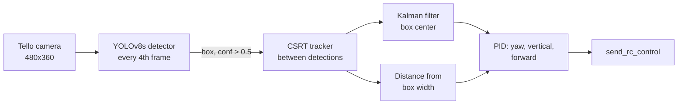
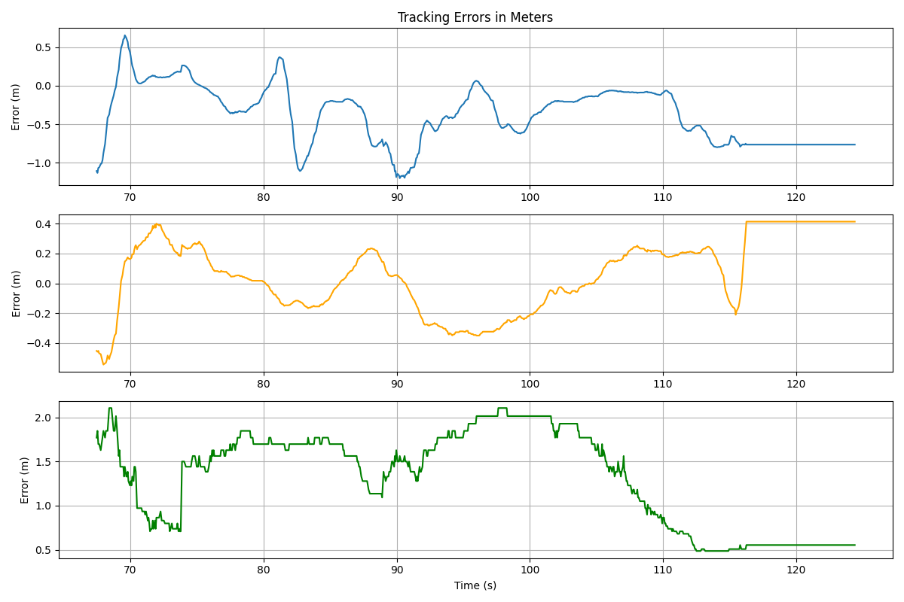
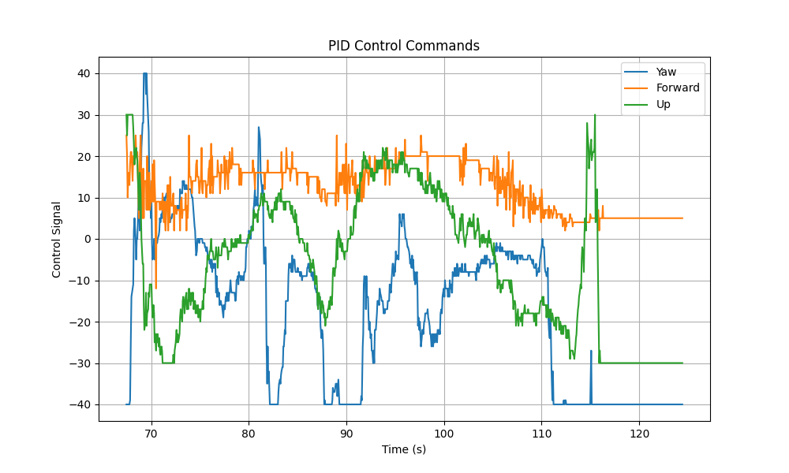
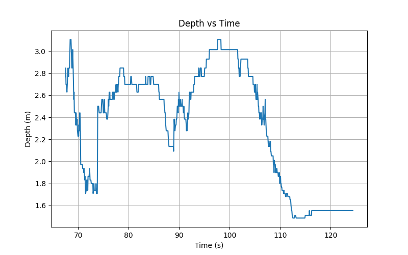
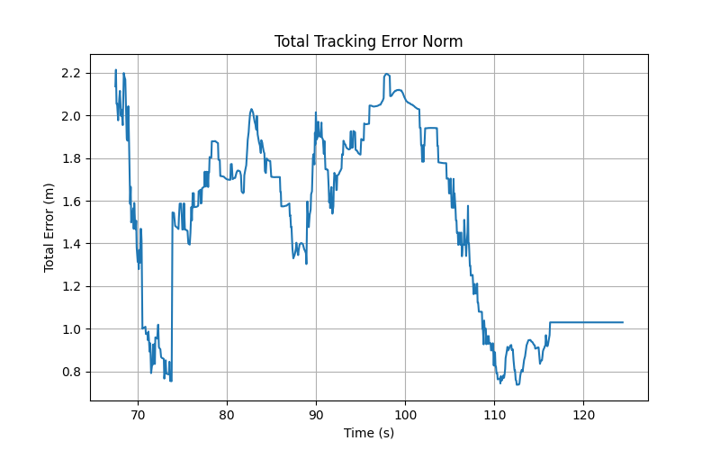

# RC Car Following with a DJI Tello

A DJI Tello that detects a moving RC car with a custom-trained YOLOv8 model and follows it from 1 m away, using only its onboard camera.

<p align="center">
  
</p>
<p align="center"><sub>Outdoor run from the Tello's onboard camera. The overlay shows estimated distance, pixel errors (ex, ey), and the distance error (ez).</sub></p>

## How it works



- **Detection.** A YOLOv8s model trained on the RC car runs at 320 px input on every 4th frame. The highest-confidence box above 0.5 re-initializes the tracker.
- **Tracking.** An OpenCV CSRT tracker follows the box between detections, so the control loop isn't limited by detector speed.
- **State estimation.** A constant-velocity Kalman filter smooths the box center in pixel space.
- **Distance.** A pinhole-camera model estimates range from the box width (`focal_length × real_width / pixel_width`).
- **Control.** Three PID loops turn the errors into Tello RC commands:
  - horizontal pixel error → yaw
  - vertical pixel error → climb/descend (aimed 30 px below center, so the drone stays slightly above the car)
  - distance error → forward/back, holding 1.0 m with a ±0.35 m deadband
- **Safety.** When the target is lost, the drone holds position. Pressing `q` stops all motion and lands.

Each control step is logged to CSV for offline analysis.

## Detector training

The dataset is a single class (`rc_car`) of the car on several surfaces: indoor floors, rugs, sand, and dirt. `frames_producing.py` pulls evenly spaced frames from a video for labeling; `extracted_frames/` holds 1,000 indoor frames made this way. Two models were trained for 50 epochs at 640 px:

| Model | Precision | Recall | mAP50 | mAP50-95 |
| --- | --- | --- | --- | --- |
| YOLOv8n | 1.000 | 1.000 | 0.995 | 0.935 |
| **YOLOv8s** (used in flight) | 0.998 | 1.000 | 0.995 | **0.937** |

These are validation scores. The validation images are consecutive video frames of the same kind as the training set, so they show how well the model fits this footage, not how it generalizes. The outdoor flight above, on asphalt, is the better real-world test.

Training curves, confusion matrices, and sample predictions are in [`model2/`](model2/).

## Flight results

`plot_results.py` converts the logged pixel errors to meters using the estimated distance, then plots tracking error, distance, and PID commands. The plots below are from a run where the car drove in a circle ([`logs/circle.csv`](logs/circle.csv)):

| Tracking error (x, y, distance) | PID commands |
| --- | --- |
|  |  |
| **Estimated distance** | **Total error norm** |
|  |  |

On the circular path the drone kept following the car but trailed it at 1.5–3 m, against a 1 m target. The yaw command is at its ±40 limit in about a third of control steps, so the car's turns outpace how fast the drone is allowed to rotate. The forward command never reaches its limit (median 13 of 40), so a higher forward gain is the obvious next tuning step. On the straighter outdoor path in the demo, the drone closes to about 1 m.

## Repository layout

| Path | Contents |
| --- | --- |
| `chaser_yolo.py` | Main follower: detection, tracking, Kalman filter, PID control, logging |
| `chaser_tester.py` | Detection-only test on the Tello stream (no flight commands) |
| `frames_producing.py` | Extracts evenly spaced training frames from a video |
| `plot_results.py` | Plots tracking error, distance, and control commands from a log |
| `model2/` | YOLOv8n and YOLOv8s training runs, with `weights/best.pt` |
| `train/` | Earlier YOLOv8n run (30 epochs) used by `chaser_tester.py` |
| `logs/`, `flight_log.csv` | Logged flight data |
| `extracted_frames/` | Indoor frames extracted for labeling |
| `Lit/` | Reference paper |

## Running

```bash
pip install djitellopy ultralytics opencv-contrib-python numpy pandas matplotlib

# Connect to the Tello's Wi-Fi, then from the repository root:
python chaser_yolo.py     # takes off and follows; press q to land
python plot_results.py    # plots logs/circle.csv
```

Fly in an open area. The drone takes off as soon as the script connects.

## Limitations

- Distance comes from a fixed real-world width (0.22 m) and an approximate focal length (466 px), so it's only as accurate as those two assumptions and the box fit.
- Errors are measured in the image, and there is no global position, so the drone can't anticipate the car's turns.
- The detector knows a single RC car. Other vehicles, or very different lighting, would need more labeled data.
